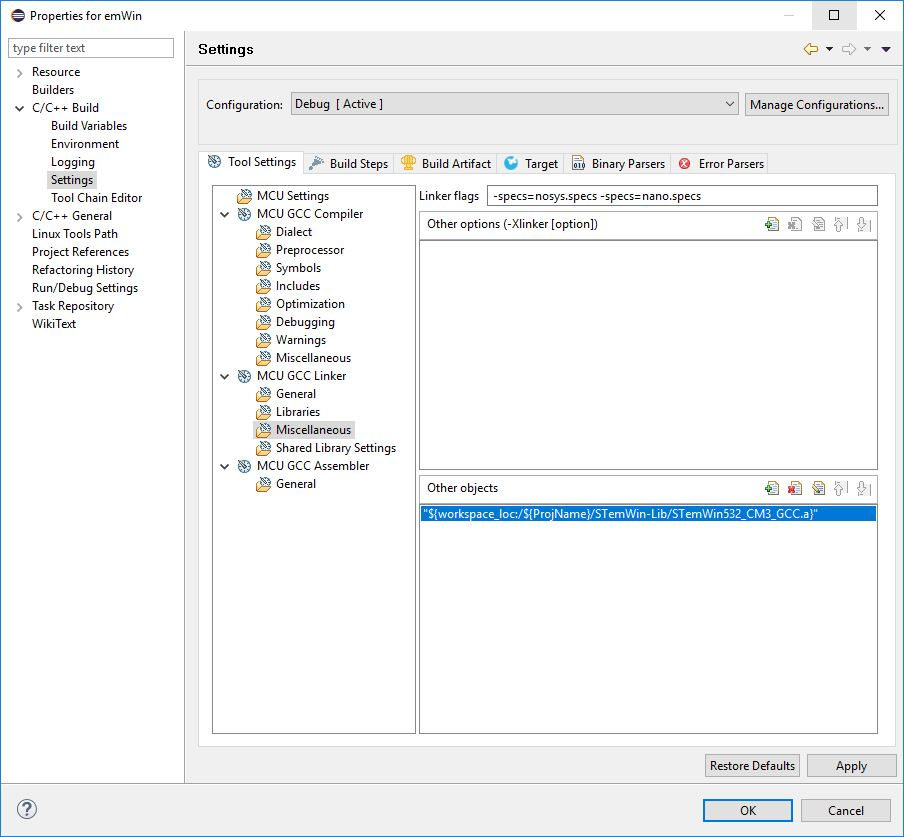
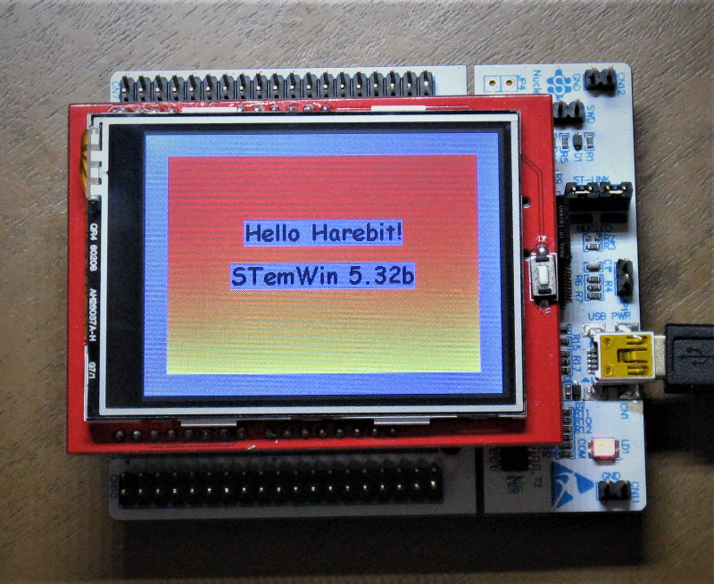

###Description
I presume you have an IDE, in this example I use SW4STM32 (Eclipse), STM32CubeMX and STemWin.

You can download all from STMicroelectronics
The files for STemWin is including in the STM32Cube MCU Package e.g. STM32CubeF1.    
Inside of the package is an folder "...\STM32Cube_FW_F1_V1.6.0\Middlewares\ST\STemWin".

Make the configuration in STM32CubeMX as you see in the emWin.pdf.

You have to link the objects from STemWin in the linker as you see in the picture.

	

 
Compile the project and program your controller.

The display should look like this.   

harebit